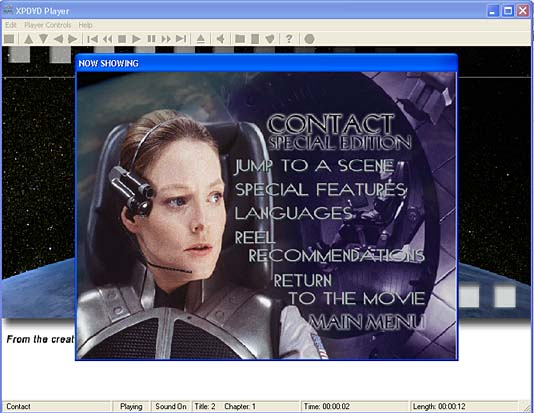



## DVD Player

### Description

This is a feature rich DVD player that will allow users to see the graphic of a title that is "Now Showing", see additional movie information, construct a playlist unlike any other DVD player including winDVD and PowerDVD. This is the basis that I used for the commercial product. An excellent example of the start of a marketable player.
 
### More Info
 
I have tried to use as many techniques in this code as possible to show different ways of doing some of the same things. Although this code could be streamlined some it's still pretty slim. Enjoy!!!!

Ask me about Talk2Me DVD - the Ultimate in Interactive DVDs

             |
---                |---
**Submitted On**   |2002-02-16 10:16:38
**By**             |[AlexHogan](https://github.com/Planet-Source-Code/PSCIndex/blob/master/ByAuthor/alexhogan.md)
**Level**          |Intermediate
**User Rating**    |4.9 (34 globes from 7 users)
**Compatibility**  |VB 5\.0, VB 6\.0
**Category**       |[Complete Applications](https://github.com/Planet-Source-Code/PSCIndex/blob/master/ByCategory/complete-applications__1-27.md)
**World**          |[Visual Basic](https://github.com/Planet-Source-Code/PSCIndex/blob/master/ByWorld/visual-basic.md)
**Archive File**   |[DVD\_Player556422162002\.zip](https://github.com/Planet-Source-Code/alexhogan-dvd-player__1-31859/archive/master.zip)

### API Declarations

Included in zip file.

